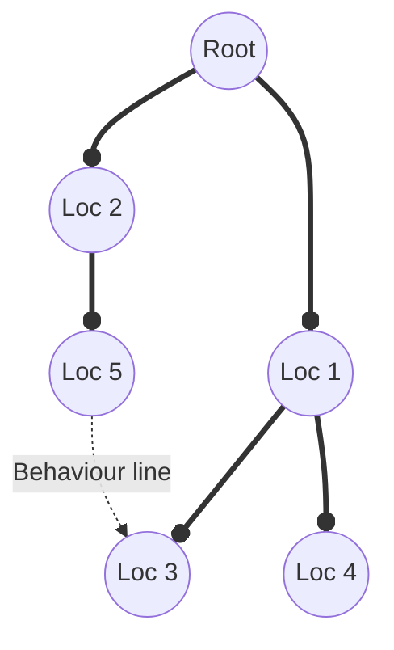

# Backbone map

A map is a backbone structure for the whole platform. It is a tree/graph structure, where tree is a data line and graph is behaviour line, you can think of it as a human backbone and blood vessels. Nodes in this structure are called locations.

The main idea behind it is providing a scope for bot actions.

## Data line

A tree part of the map structure. Defines how the data and toolset is propagated.

## Behaviour line

A collection of graph edges, that define how the bot must go from one location to another.

## Location

Defines data and toolset that a bot can use in it.

## Propagation rules (data line)

1. ### Data scoping

   Parent nodes have access to descendant nodes data. Child nodes don't have access to ancestor nodes data.

2. ### Toolset propagation

   Toolset is accumulated from ancestors to descendants.
