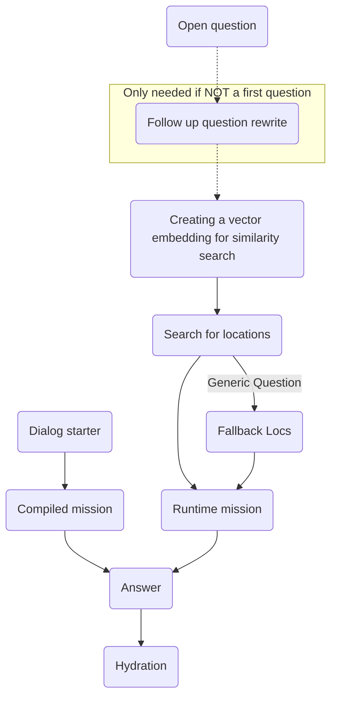

# Flow

```mermaid
graph TB
    dialogStarter --> compiledMission
    compiledMission --> answer

    question .-> rewrite
    rewrite .-> embed
    embed --> findLocs
    findLocs -->|Generic Question| fallbackLocs
    findLocs & fallbackLocs --> runtimeMission
    runtimeMission --> answer
    answer --> hydration

    dialogStarter(Dialog starter)
    compiledMission(Compiled mission)

    subgraph styleGraph [Only needed if NOT a first question]
       rewrite
    end

    question(Open question)
    rewrite(Follow up question rewrite)
    embed(Creating a vector embedding for similarity search)
    findLocs(Search for locations)
    fallbackLocs(Fallback Locs)
    runtimeMission(Runtime mission)
    answer(Answer)
    hydration(Hydration)
```
