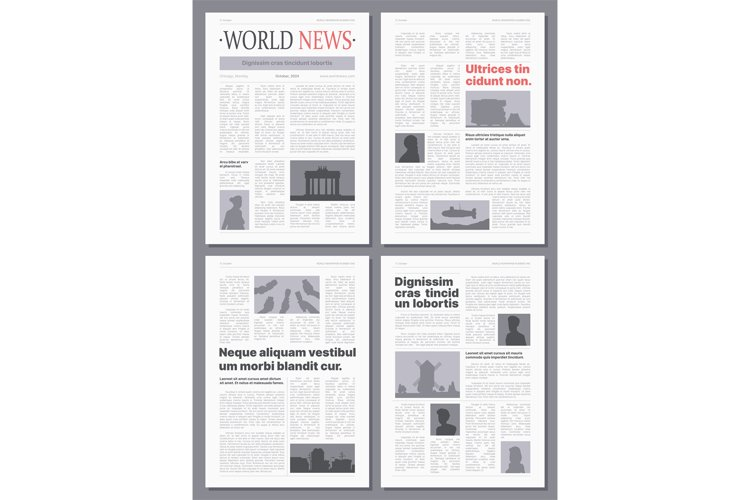

# Webscraping

TODO:

1. Write about scraping step
2. Write about saving step and map producing
3. Write about postprocessing step
4. Add info about orphans

DONE:

1. Write about part of chunking step

Scarping/chunking the html document to save chunks into vector database.

## Glossary

- **Chunking** - dividing a document into separate parts based on cohesion
- **Chunk** - a self contained part of a document, can be used with _weak_ linking to the parent document(like quoting)
- _Texted_ - something containing text data
- **Orphan** - a part of a document that by all means of _logic_ (cohesion) has to be **chunked together** with another part of a document, but it's wasn't😭
- **Cohesion** - a logical connection between media and text with another text

## Cohesion



When we see some structured document (article in a paper, html, pdf), we can say based on a **markup only** (with random text and hidden media), that some parts of it probably have a **higher connection** between each other, than with other parts. Like _heading_ of an article do have a connection with all article's text, but it's **less** than a connection between _subheader_ and its corresponding _part_ of the _same_ article. Same goes for _media_, an _image_ placed near some part of a text has a **higher connection** to it, than to any other _part_ of a document (even to _subheader_ of this text).

We call this connection **cohesion**. _High_ cohesion means text and media/text are logically connected, _low_ - the opposite.
Cohesion is important for **chunking**, because chunking is essentially dividing a document into separate parts based on cohesion.
For every **document**(data structure) **type** a **cohesion algorithm** is different. Down you'll see [chunking rules](#html-chunking-rules), this is a description of cohesion algorithm for HTML documents.

## HTML Chunking rules

Cohesion in HTML (without css and any visualization) is based on meaning behind the tags and tree structure of a document, where sibling nodes have a higher cohesion towards each other, than towards their outer parents. **Horizontal cohesion over vertical**.

<details>
   <summary>Visual explanation</summary>

```html
<article>
  <h1>I'm a parent</h1>

  <section>
    <h2>I'm a subheading</h2>
    I also have some text and media
  </section>

  Here goes some text.
</article>
```

The cohesion between _h2_ and _text_ in the _section_ is higher towards each other than towards _h1_ and _article's text_.

</details>

1. ### Containers

   There're several types of tags in HTML:

   - Meaning styling (_i_, **b**, ~~s~~, etc.)
   - Administrative (head, body, html, meta, etc)
   - Media (img, source, video, etc.)
   - Markup containers (div, article, header, span, etc.)

   We're interested in the last group, even a subgroup, excluding inline containers, like _span_, because they usually used only for styling and not for separating one part of the document from another.

   These containers are our natural **friends** in chunking, yet they can _fool us_ into thinking they are used for meaning separation, while being used for ~~styling~~(🤮). To not be fooled we have a list of rules to distinguish friends from evil(~~styling🤮🤮~~).

   **Signs of styling containers:**

   - Empty container with no text and media children in it
   - For now that's it, but enemy is not sleeping, we'll see even more insidious traps, I'm sure

2. ### Same parent

   One chunk can contain **only** nodes, who are **siblings** to each other, with an exception of [orphans](#orphans), which have a _foster_(this chunk's) parent.

   <details>
      <summary>Example of <i>Same Parent</i> violation</summary>

   ```html
   <section>
     <div></div>
     -> added to chunk1
   </section>

   <div></div>
   -> cannot be added to chunk1, if not an orphan
   ```

   </details>

3. ### Continuity

   **Texted node** can be added to a chunk **only** if _last_ node added to that chunk is its _sibling_.

   <details>
      <summary> Example of <i>continuity</i> violation</summary>

   ```html
   <div>Hi, I'm div1</div>
   -> added to chunk1

   <section>
     <div>Even more subdivision and text</div>
   </section>
   -> gets subchunked

   <div>Hi, I'm div2</div>
   -> cannot be added to the same chunk as div1, continuity will be violated
   ```

   </details>

4. ### Non-dividable nodes

   This nodes are the _opposite_ of [containers](#containers), they cannot be chunked and **must** be included in a chunk despite violating _OptimalChunkSize_ setting.

   These nodes are every node **outside** of container's category, so these are any media, styling nodes, even if there are **texted** (headers, paragraphs).

5. ### Media content

   To be able

6. ### Orphans

   Can be added only to ancestors
